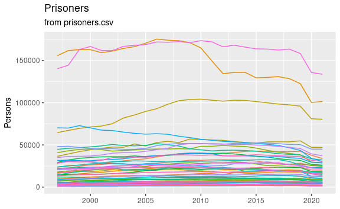

# US prison data
Mitsuo Shiota
2023-06-07

Updated: 2023-06-07

## Data source

I have downloaded zip files on annual prison data from [Bureau of
Justice
Statistics](https://bjs.ojp.gov/library/publications/list?series_filter=Prisoners),
extracted, and saved csv files on imprison rates and sentenced prisoners
by state in `data` directory.

I have also downloaded some Excel, csv, text files on state resident
population from [Census
Bureau](https://www.census.gov/data/tables/time-series/demo/popest/2020s-state-total.html),
and saved them in `data` directory.

## 3 csv files created

From files in `data` directory, I have made 3 csv files:

- imprison_rate.csv: Number of sentenced prisoners per 100,000 residents
  by state and year from 2007 to 2021,

- sentenced_prisoners.csv: Number of (more than one year) sentenced
  prisoners by state and year from 1997 to 2021, and

- population.csv: Resident population by state and year from 1997 to
  2021.

## Plot

